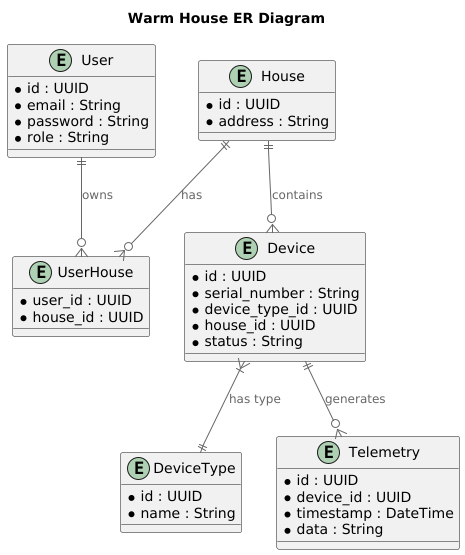

Это шаблон для решения **первой части** проектной работы. Структура этого файла повторяет структуру заданий. Заполняйте его по мере работы над решением.

# Задание 1. Анализ и планирование

Чтобы составить документ с описанием текущей архитектуры приложения, можно часть информации взять из описания компании условия задания. Это нормально.

### 1. Описание функциональности монолитного приложения

**Управление отоплением:**

- Пользователи могут управлять отоплением.
- Система поддерживает управление температурой через веб интерфейс.

**Мониторинг температуры:**

- Пользователи могут - проверять температуру.
- Система поддерживает проверку температуры через веб интерфейс.

### 2. Анализ архитектуры монолитного приложения

Перечислите здесь основные особенности текущего приложения: какой язык программирования используется, какая база данных, как организовано взаимодействие между компонентами и так далее.
Язык программирования: Java
БД: PostgreSQL
Взаимодесвтие синхронное: Веб интерфейса -> Сервер -> Датчик
Масштабировать можно только весь сервер целиком.

### 3. Определение доменов и границы контекстов

Опишите здесь домены, которые вы выделили.

1) Управление устройствами - отправка команд на устройства.
2) Мониторинг устройств - получение данных от устройств.
3) Панель управления пользователя - доступ ко всем датчикам пользователя.

### **4. Проблемы монолитного решения**

- Невозможность масштабировать нагруженные домены отдельно.
- Необходимость перезагружать всю систему при изменениях в отдельном домене.
- Синхронное взаимодествие компонентов, что снижает скорость работы.
- Невозможность подключения устройства без специалиста (хотя это скорее всего можно и в монолите реализовать)

### 5. Визуализация контекста системы — диаграмма С4

# Задание 2. Проектирование микросервисной архитектуры

В этом задании вам нужно предоставить только диаграммы в модели C4. Мы не просим вас отдельно описывать получившиеся микросервисы и то, как вы определили взаимодействия между компонентами To-Be системы. Если вы правильно подготовите диаграммы C4, они и так это покажут.

**Диаграмма контейнеров (Containers)**

**Диаграмма компонентов (Components)**

**Диаграмма кода (Code)**

# Задание 3. Разработка ER-диаграммы

